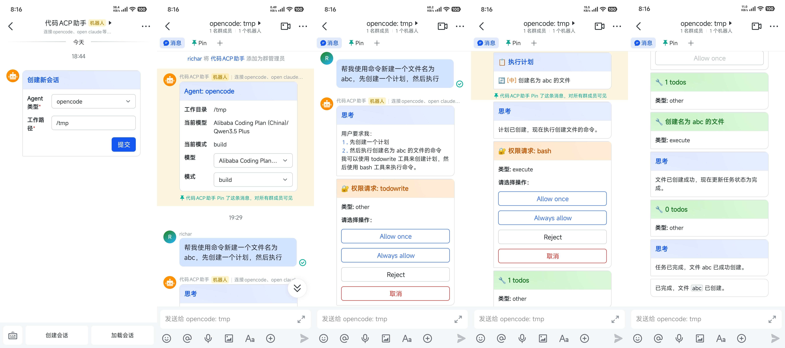
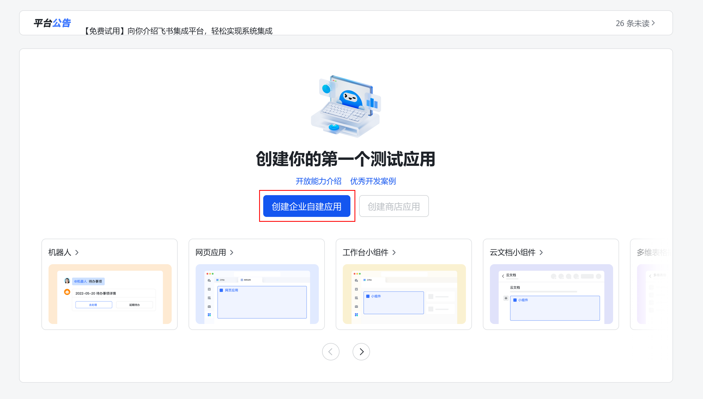
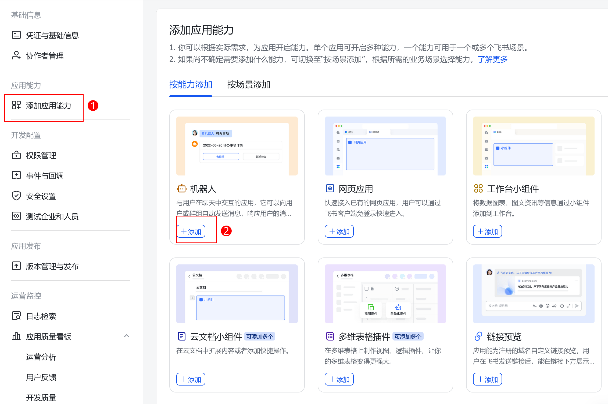
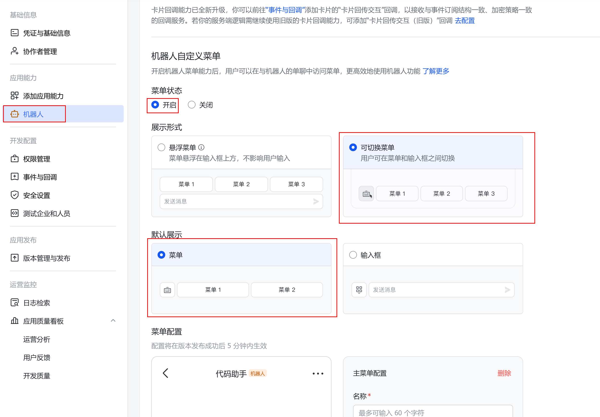
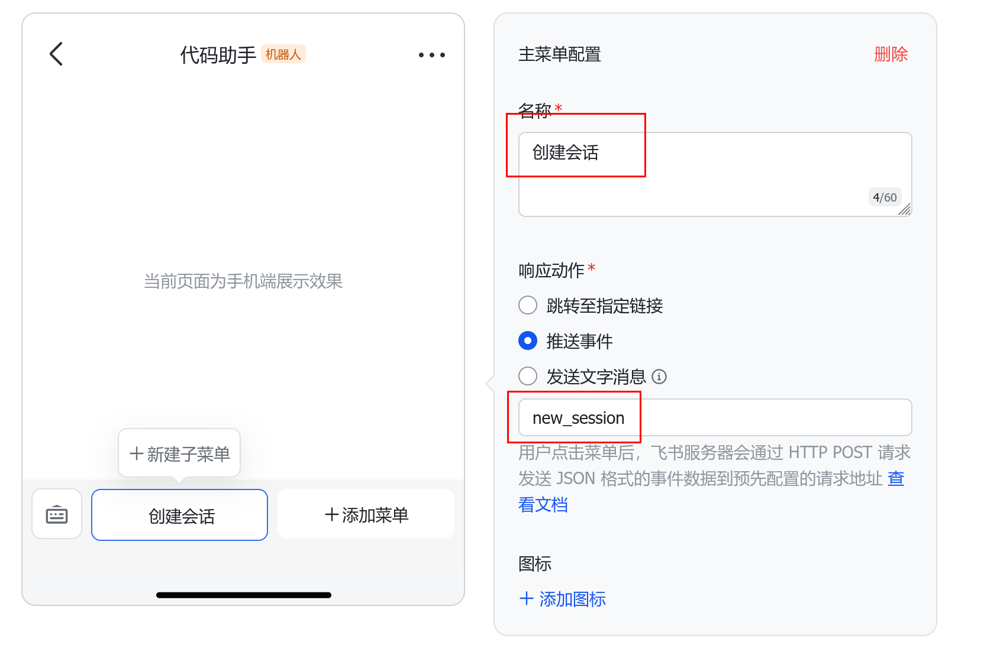
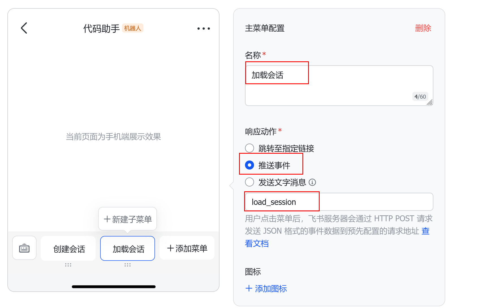
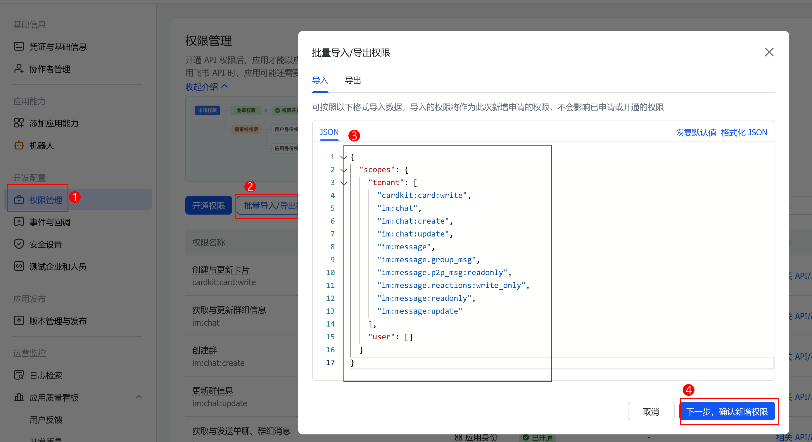
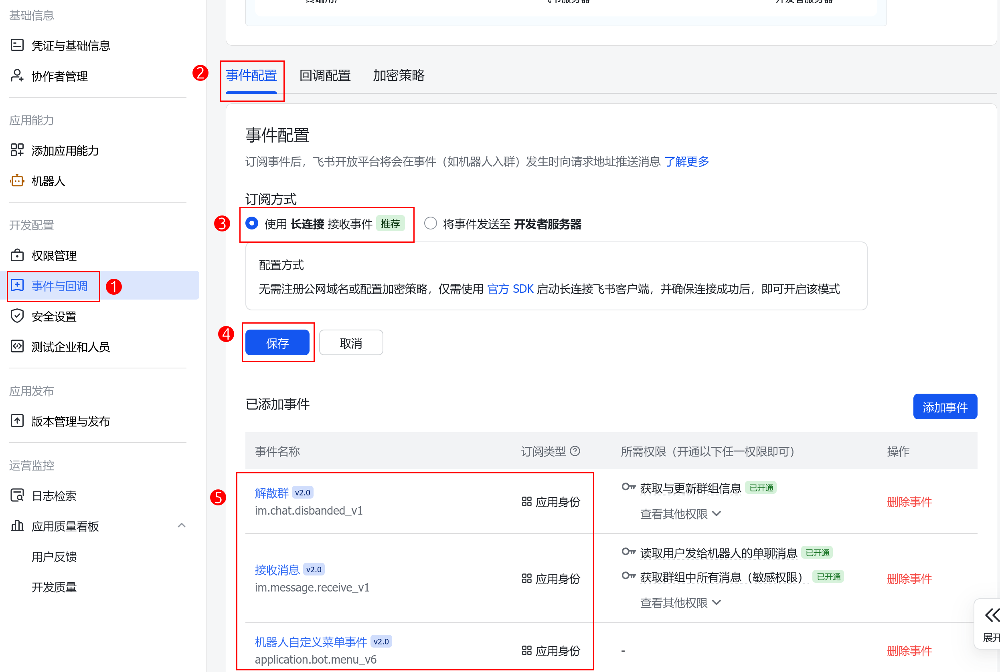
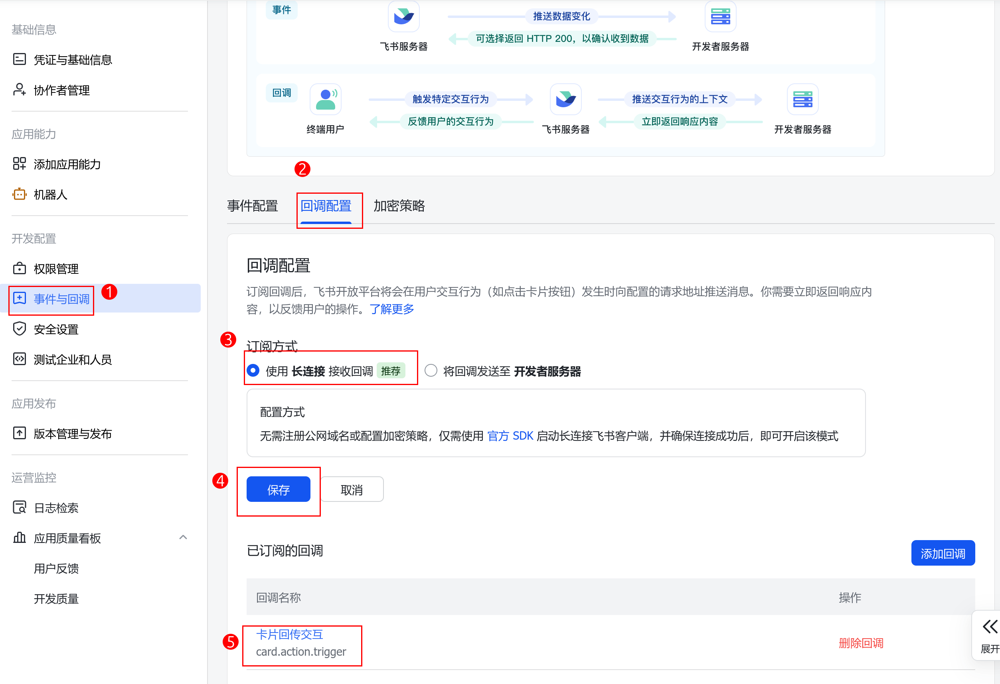
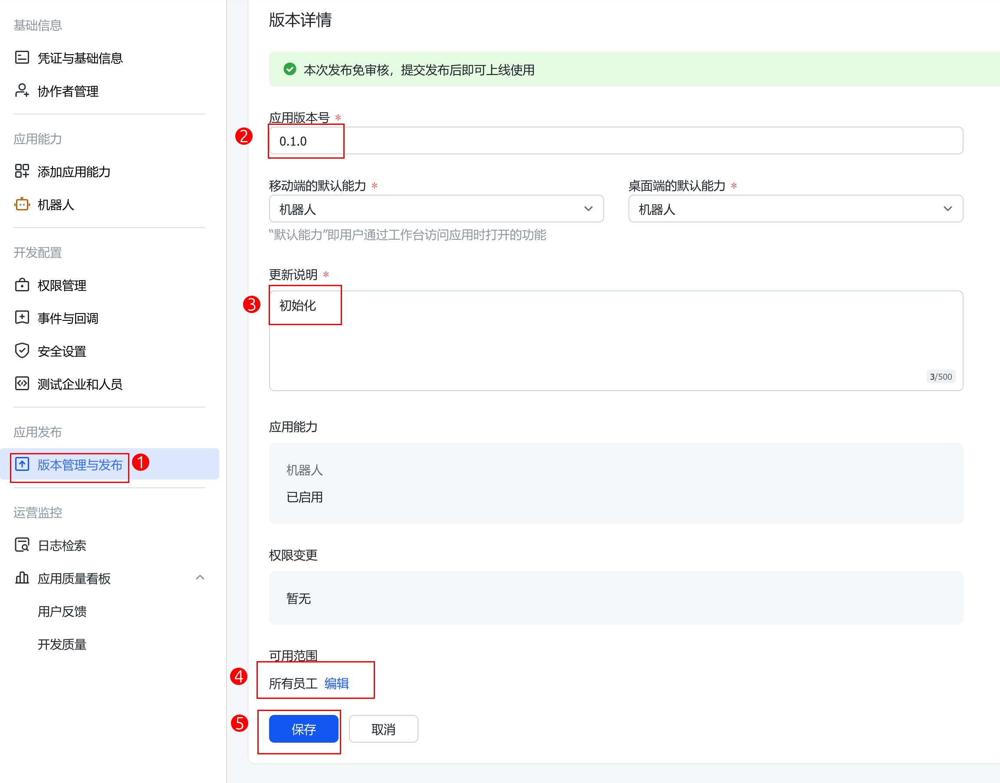

# Lark-ACP

连接飞书和ACP(Agent Communication Protocol)的工具。让你能够在飞书中使用OpenCode、Claude、Codex、Qwen等任何支持ACP的工具。

## 效果图



## 功能特性

- 纯WebSocket长连接
- 交互式卡片
- 支持多 Agent 配置
- 支持权限选择卡片
- 支持思考、工具调用的卡片展示
- 支持切换会话模型、模式
- 流式传输

## 配置

配置文件位于
- Linux: `$XDG_CONFIG_HOME/lark-acp/config.toml`：
- MacOS: `$HOME/Library/Application Support/lark-acp/config.toml`
- Windows: `%APPDATA%\lark-acp\config.toml`

```toml
feishu_app_id = "cli_xxxxxxxxxxxxxxxx"
feishu_app_secret = "xxxxxxxxxxxxxxxxxxxxxxxxxxxxxxxx"

[[agent]]
id = "opencode"
cmd = ["opencode", "acp"]

[[agent]]
id = "claude"
env = {
   ANTHROPIC_AUTH_TOKEN="sk-xxxxxxxxxx",
   ANTHROPIC_BASE_URL="https://xxxxxxxxxxxxx",
   ANTHROPIC_MODEL="gpt-5.4"
}
cmd = ["claude-agent-acp"]

[[agent]]
id = "codex"
cmd = ["codex-acp"]
```

## 常见工具的接入方式

| Agent | 依赖 | 命令 |
|-------|------|------|
| OpenCode | - | `opencode acp` |
| Codex | [zed-industries/codex-acp](https://github.com/zed-industries/codex-acp/releases) | `codex-acp` |
| Claude Code | [agentclientprotocol/claude-agent-acp](https://github.com/agentclientprotocol/claude-agent-acp/releases) | `claude-agent-acp` |
| Gemini | - | `gemini --experimental-acp` |
| GitHub Copilot | - | `npx @github/copilot-language-server@latest --acp` |
| Qwen Code | - | `qwen --acp` |
| Auggie Code | - | `auggie --acp` |
| Qoder | - | `qodercli --acp` |
| OpenClaw | - | `openclaw acp` |

## 使用

1. 在[飞书开放平台](https://open.feishu.cn/app)创建应用，输入你想要的应用名称和描述，并选择图标。
   
2. 复制应用凭证，App ID和App Secret到配置文件。
3. 添加应用能力 -> 机器人
   
4. 给机器人添加自定义菜单。添加两个按钮，分别为“创建会话”“加载会话”。响应动作都是推送事件。事件名称分别为`new_session`和`load_session`。最后点击保存
   
   
   
5. 添加权限。点击权限管理 -> 批量导入/导出权限 -> 粘贴下面权限
```json
{
  "scopes": {
    "tenant": [
      "cardkit:card:write",
      "im:chat",
      "im:chat:create",
      "im:chat:update",
      "im:message",
      "im:message.group_msg",
      "im:message.p2p_msg:readonly",
      "im:message.reactions:write_only",
      "im:message:readonly",
      "im:message:update"
    ],
    "user": []
  }
}
```
   
6. 添加事件。事件与回调 -> 事件配置。订阅方式为使用长连接接收事件。然后添加 “解散群”“接收消息”“机器人自定义菜单事件”这三种事件，三者都是应用身份订阅。
   
7. 添加回调。事件与回调 -> 事件配置。订阅方式为使用长连接接收事件。然后添加 “卡片回传交互”回调。
   
8. 发布版本。版本管理与发布 -> 创建版本。按下图填写资料并发布。可用范围可根据实际情况调整。所选择的范围为实际可以使用该应用的人员。
   

9. 编辑配置`$XDG_CONFIG_HOME/lark-acp/config.toml`，并运行程序：

```bash
./lark-acp
```

10. 在飞书中找到改机器人，点击机器人菜单的"新建会话"按钮，就可以开始使用了
